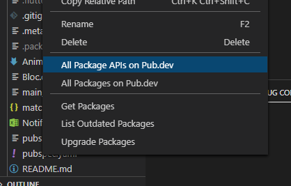
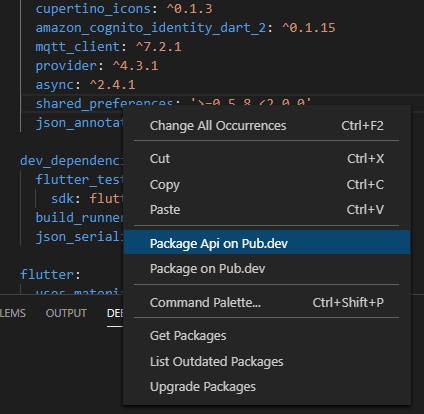

# Flutter Pub Open README

This extension will help you open Flutter/Dart package page and API documentation on pub.dev.

It works on all packages specified dependencies and dev_dependencies in pubspec.yaml - excluding flutter, cuppertino_icons and flutter_test.

## Features

Right click on pubspec.yaml in file explorer will show two menu options:
* All Package APIs on Pub.dev - this will open pub.dev/documentation/package/latest for all packages in pubspec.yaml
* All Packages on Pub.dev - this will open pub.dev/package for all packages in pubspec.yaml

Right click on a package name in pubspec.yaml:
* Package API on Pub.dev - this will open pub.dev/documentation/package/latest for selected package
* Package on Pub.dev - this will open pub.dev/package for slected package

> Tip: You can set pub.dev as trusted site to prevent VS Code asking you to allow opening URL each time

## Requirements

N/A

## Extension Settings

N/A

## Known Issues

N/A

## Release Notes

### 0.0.1

Initial release of the package.

